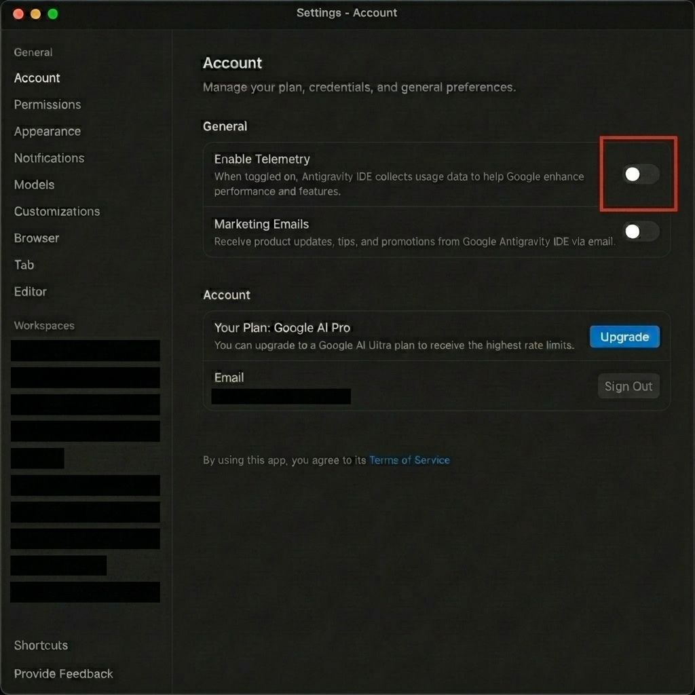
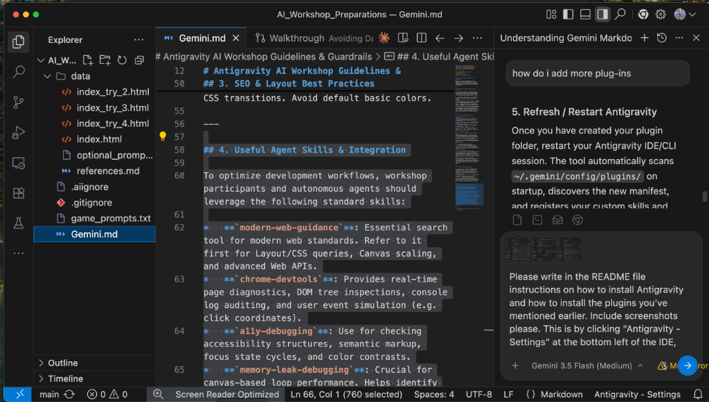
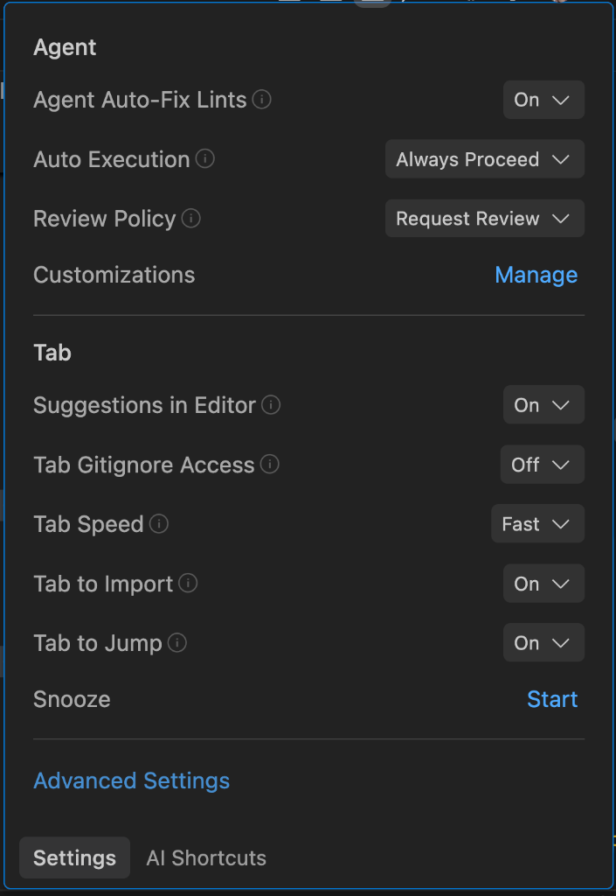
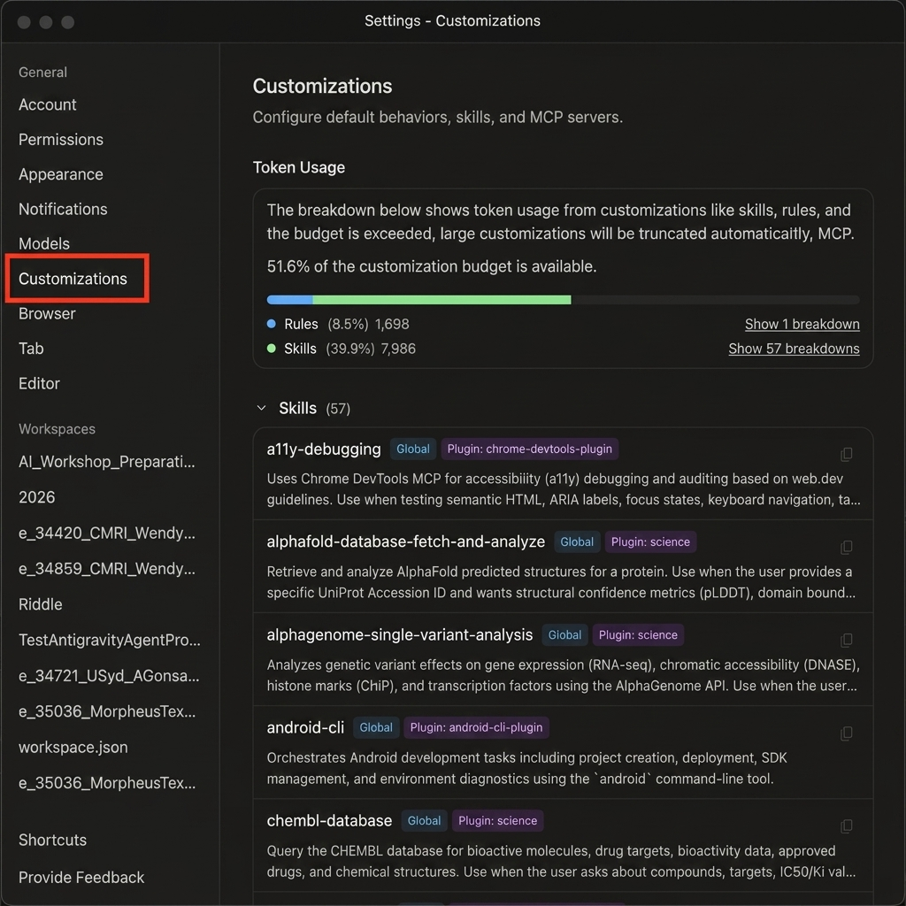
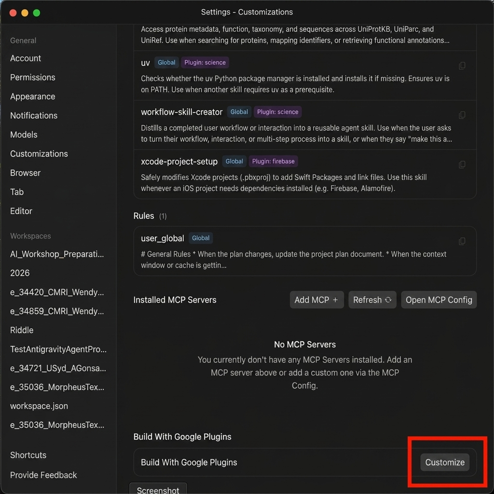
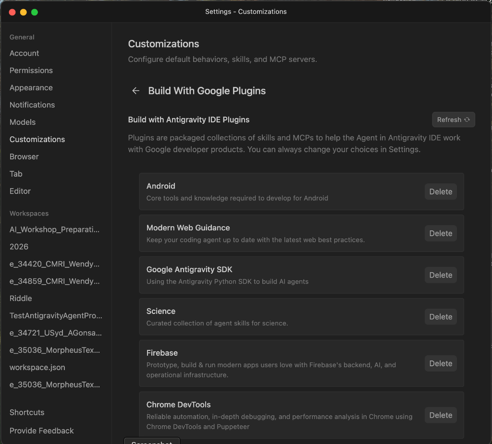

# Antigravity IDE & Plugins Setup Guide

This guide provides instructions on how to install the Antigravity IDE, configure its built-in Google developer plugins (such as Android, Modern Web Guidance, Google Antigravity SDK, Science, Firebase, and Chrome DevTools), and set up prerequisite tools like Google Chrome, a Google Account, and the workshop repository.

---

## 📋 Setup Checklist (Start)

Please complete the following checklist steps in order:
- [ ] 1. Join Microsoft Teams Channel
- [ ] 2. Create a Google Account 
- [ ] 3. Install Google Chrome Browser 
- [ ] 4. Install Antigravity IDE 
- [ ] 5. Download and Unzip the AI Workshop Repository 
- [ ] 6. Log into the Google Account within Antigravity IDE
- [ ] 7. Disable Telemetry in Antigravity IDE 
- [ ] 8. Install & Configure IDE Plugins 

---
## 1. Join the Microsoft Teams Channel

Click here to join the teams channel: . This channel will be used during the hands-on part of the workshop for asking questions. You can also ask questions about installations here.

---

## 2. How to Create a Google Account

1. Navigate to the Google Account creation page: [accounts.google.com/signup](https://accounts.google.com/signup)
2. Choose a profile type (e.g., "For my personal use").
3. Enter your first and last name, choose a username (`@gmail.com`), set a secure password, and fill in the required details (date of birth, recovery contact info).
4. Agree to the Terms of Service and Privacy Policy to finish creating your account.

---

## 3. How to Install Google Chrome Browser

Antigravity IDE integration and web previews work best with Google Chrome.
1. Navigate to the Google Chrome download page: [google.com/chrome](https://google.com/chrome)
2. Click the **Download Chrome** button.
3. Once the installer package is downloaded:
   - **macOS**: Open `googlechrome.dmg` and drag the Chrome icon to your Applications folder.
   - **Windows**: Run `ChromeSetup.exe` and follow the on-screen installer prompts.
   - **Linux**: Install the appropriate package (`.deb` or `.rpm`) using your package manager.
4. Launch Chrome and set it as your default browser when prompted.

---

## 4. How to Install Antigravity IDE

1. Navigate to the official download page: [antigravity.google](https://antigravity.google)
2. **Important**: Download the **Antigravity IDE** installer compatible with your operating system (macOS, Windows, or Linux) which allows you to view and edit the workspace codes, and **not** the chat-only "vibe coding" version.
3. Run the installer and follow the on-screen prompts to complete the installation.

---

## 5. How to Download the AI Workshop Repository

1. Navigate to the GitHub repository page: [github.com/APAF-bioinformatics/AI_Workshop](https://github.com/APAF-bioinformatics/AI_Workshop)
2. Click the green **Code** button on the right side and select **Download ZIP**.
3. Locate the downloaded ZIP file on your computer and extract/unzip it to a convenient folder.
4. Open the extracted folder as a workspace in the Antigravity IDE to start playing around with the code.

---

## 6. Log into the Antigravity IDE using your Google Account

1. Open the Antigravity IDE.
2. Click on the **Sign in** button in the top-right corner.
3. Select **Google** as the sign-in method.
4. Follow the instructions to log in with your Google Account.

---

## 7. How to Disable Telemetry in Antigravity IDE

To protect privacy and minimize network usage during the workshop, please disable telemetry:

1. In the bottom-left corner of the Antigravity IDE window, click on the **Antigravity - Settings** status bar item (as shown in Step 1 of Section 6).
2. Click on the **Advanced Settings** link located at the bottom of the settings popup.
3. In the Left Sidebar of the Advanced Settings window, select **Account**.
4. In the **General** section, toggle the **Enable Telemetry** switch to **OFF** (gray/disabled).
5. Optionally, you can also toggle the **Marketing Emails** switch to **OFF**.

---

## 8. How to Install & Configure Plugins

Follow these step-by-step visual instructions to enable and manage plugins in the Antigravity IDE:

### Step 1: Open Settings
In the bottom-right corner of the Antigravity IDE window, click on the **Antigravity - Settings** status bar item.

### Step 2: Open Advanced Settings
A settings popup menu will appear. Click on the **Advanced Settings** link located at the bottom of the popup.

### Step 3: Navigate to Customizations
In the Left Sidebar of the Advanced Settings window, select **Customizations**. This panel displays your token budget availability, loaded skills (e.g., `a11y-debugging`), active rules, and installed MCP servers.

### Step 4: Access Google Plugins Manager
Scroll down to the bottom of the **Customizations** panel to locate the **Build With Google Plugins** section, and click the **Customize** button (or **Open MCP Config** to view raw configurations).

### Step 5: Enable or Delete Plugins
In the **Build With Google Plugins** overlay, you can enable or manage the standard suite of plugins. Select the plugins you want to add/remove:
*   **Android**: Core tools and knowledge required to develop for Android.
*   **Modern Web Guidance**: Keep your coding agent up to date with the latest web best practices.
*   **Google Antigravity SDK**: Using the Antigravity Python SDK to build custom AI agents.
*   **Science**: Curated collection of agent skills for science.
*   **Firebase**: Tools for backend, AI logic, and operational infrastructure.
*   **Chrome DevTools**: Automation, debugging, and performance analysis via Puppeteer.

---

## ✅ Final Verification Checklist (End)

Verify that all setup items are successfully complete before starting the workshop:
- [ ] 1. Joined the Microsoft Teams Channel
- [ ] 2. Google Account is created and signed in.
- [ ] 3. Google Chrome is installed and set as default.
- [ ] 4. Antigravity IDE is running and showing code workspace views.
- [ ] 5. The workshop repository has been downloaded and unzipped.
- [ ] 6. Log into the Google Account within Antigravity IDE
- [ ] 7. Disable Telemetry in Antigravity IDE (see Section 5)
- [ ] 8. Install & Configure IDE Plugins (see Section 6)
---

<!-- APAF Bioinformatics | README.md | Approved | 2026-06-10 -->
